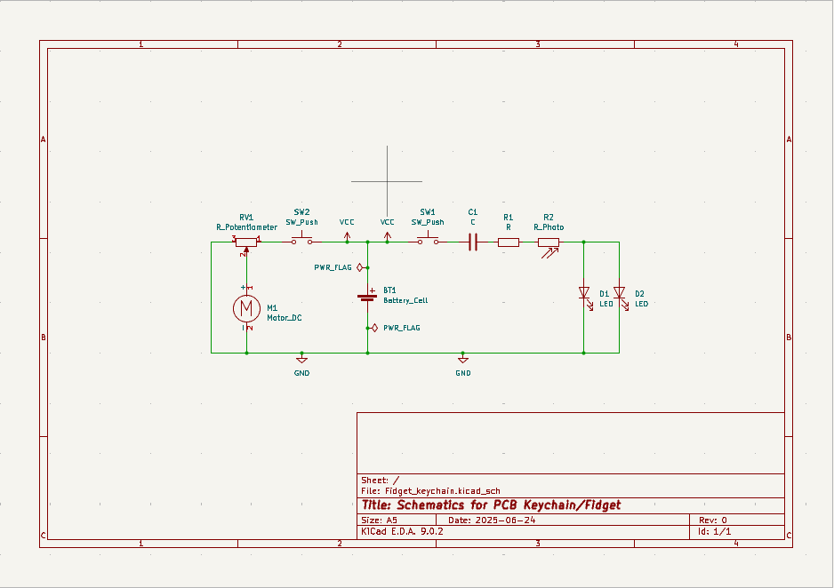
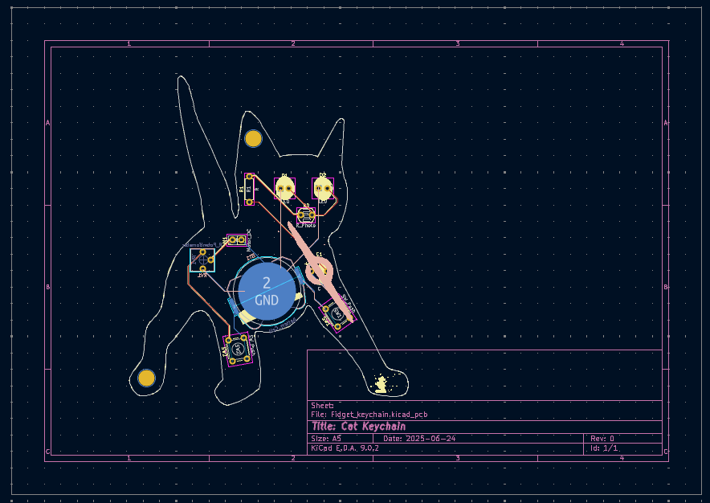
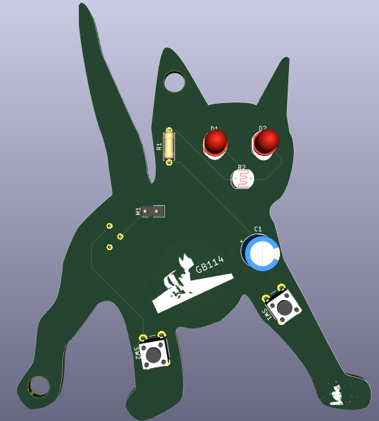
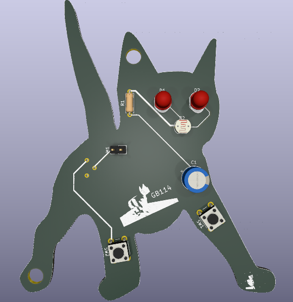
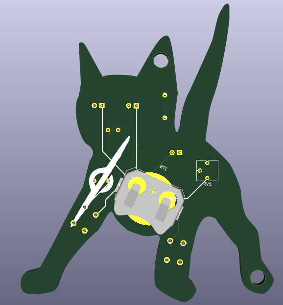
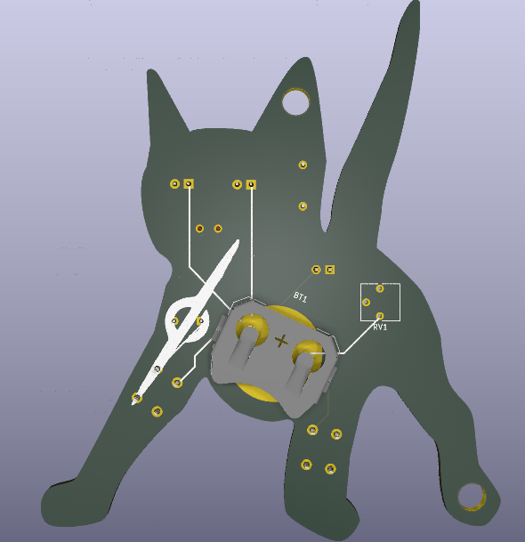

# Keychain-PCB
My first PCB design. Made for solder at hackclub.
It is a Keychain/fidget based on my PFP(profile picture) on hackclub's slack.
## BOM (Bill of Materials)
| Material        | Footprint                                  | Quantity |
|-----------------|--------------------------------------------|----------|
| Battery holder  | BatteryHolder_Keystone_3034_1x20mm         | 1        |
| Capacitor       | CP_Radial_D8.0mm_P5.00mm                   | 1        |
| LEDs            | LED_D5.0mm                                 | 2        |
| DC_Motor        | PinHeader_1x02_P2.54mm_Vertical            | 1        |
| Resistors       | R_Axial_DIN0207_L6.3mm_D2.5mm_P7.62mm_Horizontal | 2        |
| R_Photo         | R_LDR_5.1x4.3mm_P3.4mm_Vertical            | 1        |
| Potentiometer   | Potentiometer_Vishay_T73YP_Vertical        | 1        |
| Push buttons    | SW_PUSH_6mm                                | 2        |

## Schematics

## PCB

## 3D view

